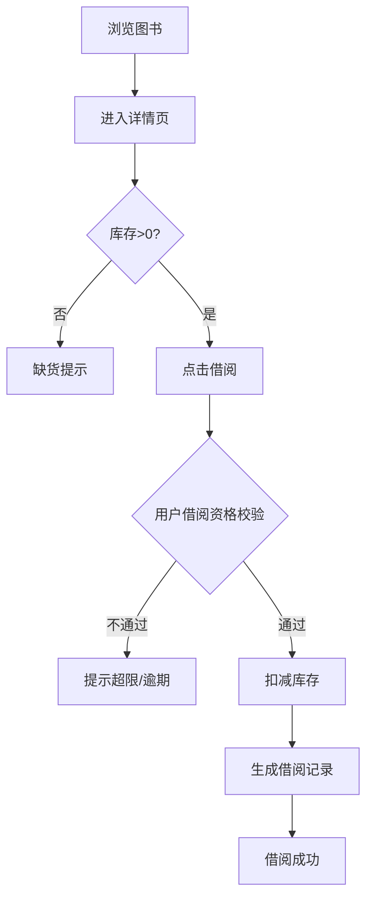
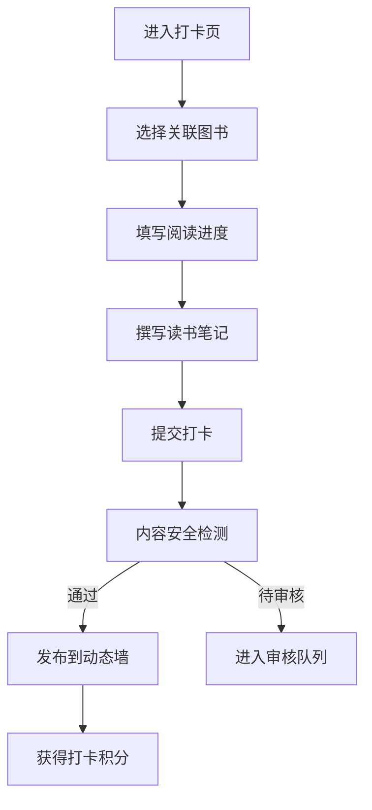

## 1. 产品概述

智慧图书借阅与打卡平台是一个集图书借阅管理、在线续借、读书打卡、笔记分享于一体的综合阅读服务系统。面向广大阅读爱好者，提供便捷的线上图书检索、借阅流程管理和阅读进度追踪功能。

- 核心价值：打造线上线下一体化阅读体验，通过数字化手段简化借阅流程，激励用户持续阅读
- 目标用户：学生、上班族、阅读爱好者及图书馆管理员

## 2. 核心功能

### 2.1 用户角色

| 角色 | 注册方式 | 核心权限 |
|------|----------|----------|
| 普通用户 | 系统默认用户 | 图书检索、借阅、续借、打卡、发布笔记 |
| 管理员 | 后台登录 | 图书入库、规则管理、内容审核、数据统计 |

### 2.2 功能模块

1. **首页模块**：新书上架、热门借阅、每日打卡榜单、分类导航、搜索入口
2. **图书检索模块**：分类筛选、书名模糊查询、作者模糊查询
3. **图书详情模块**：图书简介、章节目录、库存数量、借阅操作
4. **借阅管理模块**：借阅状态实时刷新、到期自动提醒、线上续借功能
5. **读书打卡模块**：笔记发布、阅读进度上传、打卡动态展示
6. **后台管理模块**：图书入库、借阅规则管理、内容审核

### 2.3 页面详情

| 页面名称 | 模块名称 | 功能描述 |
|-----------|-------------|---------------------|
| 首页 | 新书上架 | 横向滚动卡片展示最近入库图书，含封面、书名、作者 |
| 首页 | 热门借阅 | 网格布局展示借阅量TOP8图书，显示借阅次数 |
| 首页 | 每日打卡榜单 | 列表展示当日打卡用户，含头像、昵称、打卡内容 |
| 首页 | 搜索导航 | 分类快捷入口 + 关键词搜索框 |
| 图书列表页 | 分类筛选 | 左侧分类树，支持多级分类切换 |
| 图书列表页 | 模糊查询 | 顶部搜索栏，支持书名/作者联合搜索 |
| 图书列表页 | 结果列表 | 分页展示符合条件的图书 |
| 图书详情页 | 基本信息 | 封面、书名、作者、ISBN、分类、出版信息 |
| 图书详情页 | 简介目录 | 图书内容简介、章节目录展开 |
| 图书详情页 | 库存借阅 | 库存数量显示、借阅/预约按钮 |
| 我的借阅页 | 借阅列表 | 当前借阅图书列表，显示借阅状态、到期时间 |
| 我的借阅页 | 续借操作 | 一键续借按钮，自动延长借阅周期 |
| 我的借阅页 | 到期提醒 | 即将到期图书高亮提示，红色标注 |
| 读书打卡页 | 打卡发布 | 选择图书、填写进度、发布读书笔记 |
| 读书打卡页 | 动态墙 | 瀑布流展示所有用户打卡动态 |
| 打卡详情页 | 笔记详情 | 完整笔记内容、点赞评论交互 |
| 后台-图书管理 | 图书入库 | 表单录入新书信息，支持批量导入 |
| 后台-规则管理 | 借阅规则 | 设置借阅周期、续借次数、逾期规则 |
| 后台-内容审核 | 笔记审核 | 审核用户发布的打卡笔记 |

## 3. 核心流程

### 3.1 图书借阅流程

用户在首页或分类页浏览图书，点击进入详情页查看库存，确认有库存后点击借阅按钮，后端校验用户借阅资格后扣减库存并生成借阅记录，用户可在"我的借阅"中实时查看借阅状态。

### 3.2 读书打卡流程

用户选择已读或正在阅读的图书，填写当前阅读进度和读书笔记内容，提交后系统生成打卡记录，展示在打卡动态墙中，其他用户可点赞评论。

## 4. 用户界面设计

### 4.1 设计风格

- **主色调**：温暖书香棕 (#8B4513) + 阅读舒适绿 (#2E8B57)
- **辅助色**：米白背景 (#FDF8F3)、淡金点缀 (#DAA520)
- **按钮风格**：圆角8px，主色填充+轻微阴影，悬停上浮效果
- **字体方案**：标题使用思源宋体(Noto Serif SC)，正文使用思源黑体(Noto Sans SC)
- **布局风格**：卡片式布局，充足留白，柔和阴影
- **图标风格**：使用lucide-react线性图标，统一1.5px描边

### 4.2 页面设计概览

| 页面名称 | 模块名称 | UI元素 |
|-----------|-------------|-------------|
| 首页 | 新书上架 | 横向卡片滚动画廊，hover放大+阴影加深 |
| 首页 | 热门借阅 | 3列网格卡片，带借阅次数徽章 |
| 首页 | 打卡榜单 | 左侧头像+右侧内容的时间线布局 |
| 图书详情页 | 信息展示 | 大图封面+右侧信息网格 |
| 图书详情页 | 借阅区 | 库存进度条+醒目借阅按钮 |
| 我的借阅页 | 借阅卡片 | 到期倒计时胶囊，逾期红色警告 |
| 打卡发布页 | 编辑器 | 富文本输入框+进度滑块 |
| 打卡动态墙 | 卡片流 | 瀑布流布局+点赞动效 |

### 4.3 响应式

采用桌面端优先设计策略：
- 桌面端(≥1280px)：最大内容宽度1200px，3-4列布局
- 平板端(768-1279px)：2列布局，侧边栏折叠
- 移动端(<768px)：单列布局，底部tab导航，触控目标≥44px
