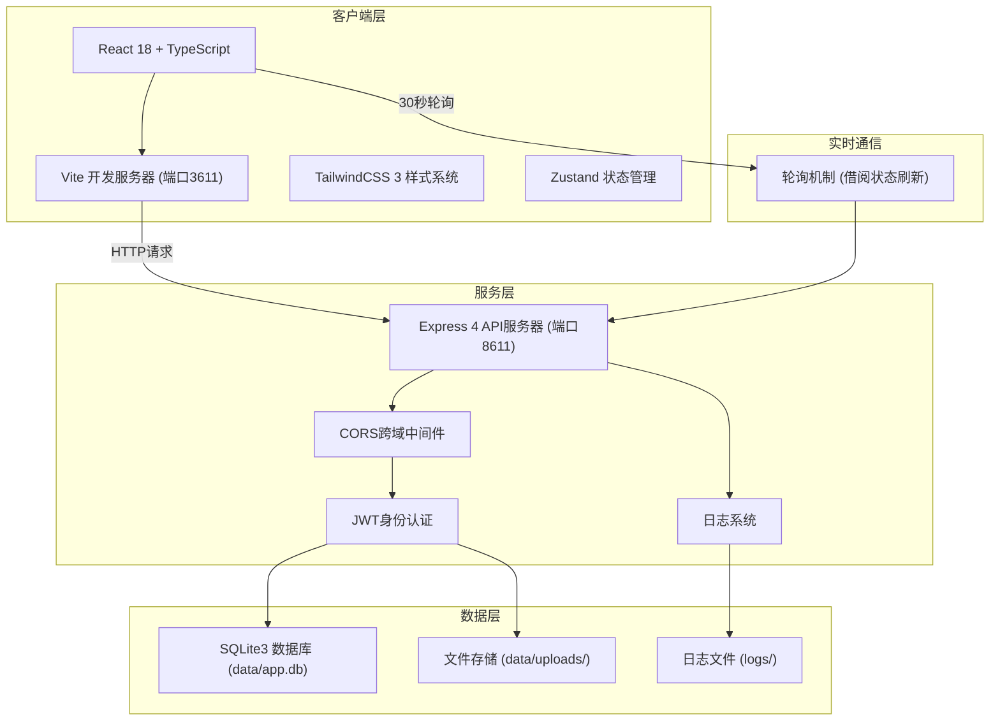
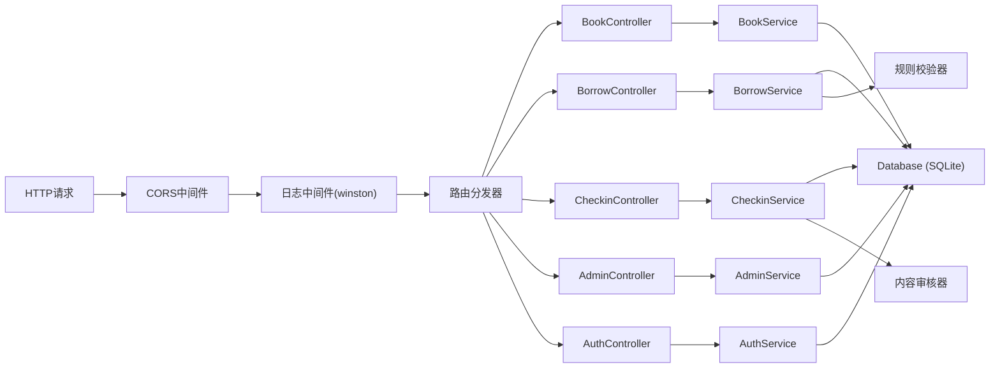
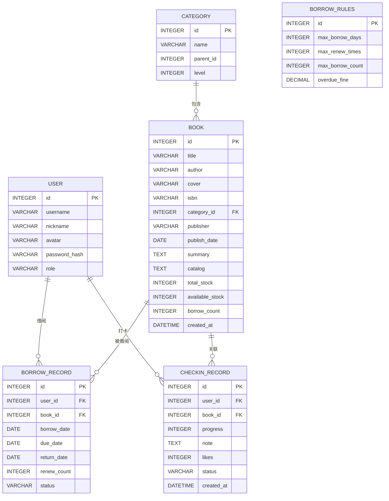

## 1. 架构设计



## 2. 技术选型说明

| 层级 | 技术栈 | 版本 | 说明 |
|------|--------|------|------|
| 前端框架 | React | 18.x | 函数组件+Hooks |
| 前端语言 | TypeScript | 5.x | 类型安全 |
| 构建工具 | Vite | 5.x | 快速热更新，端口3611 |
| 样式系统 | TailwindCSS | 3.x | 原子化CSS |
| 状态管理 | Zustand | 4.x | 轻量store |
| 路由 | react-router-dom | 6.x | SPA路由 |
| UI图标 | lucide-react | 最新 | 线性图标库 |
| HTTP客户端 | fetch API | - | 原生fetch封装 |
| 后端框架 | Express | 4.x | Node.js API框架 |
| 后端语言 | TypeScript | 5.x | ESM模块 |
| 数据库 | SQLite3 + better-sqlite3 | 最新 | 轻量级嵌入式DB |
| 日志 | winston | 3.x | 分级日志输出 |
| 认证 | JWT (jsonwebtoken) | 9.x | 无状态鉴权 |
| 参数校验 | zod | 3.x | Schema验证 |

## 3. 路由定义

### 3.1 前端路由 (React Router)

| 路由路径 | 页面组件 | 页面用途 |
|----------|----------|----------|
| `/` | HomePage | 首页(新书/热门/打卡榜单) |
| `/books` | BookListPage | 图书列表(分类检索/搜索) |
| `/books/:id` | BookDetailPage | 图书详情页 |
| `/my/borrow` | MyBorrowPage | 我的借阅(续借/到期提醒) |
| `/checkin` | CheckinPage | 读书打卡(发布/动态墙) |
| `/checkin/:id` | CheckinDetailPage | 打卡笔记详情 |
| `/admin` | AdminLayout | 后台管理布局 |
| `/admin/books` | AdminBooksPage | 图书入库管理 |
| `/admin/rules` | AdminRulesPage | 借阅规则管理 |
| `/admin/review` | AdminReviewPage | 内容审核 |
| `/login` | LoginPage | 管理员登录 |

### 3.2 后端API路由

| 方法 | 路由路径 | 控制器 | 功能说明 |
|------|----------|--------|----------|
| GET | `/api/books` | BookController.list | 图书列表+搜索+分类筛选 |
| GET | `/api/books/new` | BookController.newArrivals | 新书上架列表 |
| GET | `/api/books/hot` | BookController.hotBooks | 热门借阅列表 |
| GET | `/api/books/:id` | BookController.detail | 图书详情(含目录/库存) |
| POST | `/api/admin/books` | AdminBookController.create | 新书入库 |
| PUT | `/api/admin/books/:id` | AdminBookController.update | 更新图书信息 |
| GET | `/api/categories` | CategoryController.list | 分类列表 |
| POST | `/api/borrow` | BorrowController.create | 提交借阅 |
| GET | `/api/borrow/my` | BorrowController.myList | 我的借阅列表 |
| PUT | `/api/borrow/:id/renew` | BorrowController.renew | 续借操作 |
| GET | `/api/borrow/status` | BorrowController.status | 实时借阅状态 |
| GET | `/api/checkin/ranking` | CheckinController.dailyRanking | 每日打卡榜单 |
| GET | `/api/checkin/feed` | CheckinController.feed | 打卡动态墙 |
| POST | `/api/checkin` | CheckinController.create | 发布打卡笔记 |
| GET | `/api/checkin/:id` | CheckinController.detail | 打卡详情 |
| PUT | `/api/admin/checkin/:id/audit` | AdminReviewController.audit | 笔记审核 |
| GET | `/api/admin/rules` | AdminRulesController.get | 获取借阅规则 |
| PUT | `/api/admin/rules` | AdminRulesController.update | 更新借阅规则 |
| POST | `/api/auth/login` | AuthController.login | 管理员登录 |

## 4. API类型定义

```typescript
// 图书实体
interface Book {
  id: number;
  title: string;
  author: string;
  cover: string;
  isbn: string;
  categoryId: number;
  categoryName: string;
  publisher: string;
  publishDate: string;
  summary: string;
  catalog: string; // JSON string of chapters
  totalStock: number;
  availableStock: number;
  borrowCount: number;
  createdAt: string;
}

// 分类
interface Category {
  id: number;
  name: string;
  parentId: number;
  level: number;
}

// 借阅记录
interface BorrowRecord {
  id: number;
  userId: number;
  bookId: number;
  bookTitle: string;
  bookCover: string;
  borrowDate: string;
  dueDate: string;
  returnDate: string | null;
  renewCount: number;
  status: 'borrowing' | 'returned' | 'overdue' | 'renewed';
}

// 打卡记录
interface CheckinRecord {
  id: number;
  userId: number;
  userName: string;
  userAvatar: string;
  bookId: number;
  bookTitle: string;
  progress: number; // 0-100
  note: string;
  likes: number;
  status: 'pending' | 'approved' | 'rejected';
  createdAt: string;
}

// 借阅规则
interface BorrowRules {
  maxBorrowDays: number;
  maxRenewTimes: number;
  maxBorrowCount: number;
  overdueFinePerDay: number;
}

// 分页响应
interface PagedResponse<T> {
  list: T[];
  total: number;
  page: number;
  pageSize: number;
}

// 通用响应
interface ApiResponse<T> {
  code: number;
  message: string;
  data: T;
}
```

## 5. 服务器架构图



## 6. 数据模型

### 6.1 ER关系图



### 6.2 数据库初始化SQL

```sql
-- 分类表
CREATE TABLE IF NOT EXISTS categories (
    id INTEGER PRIMARY KEY AUTOINCREMENT,
    name VARCHAR(50) NOT NULL,
    parent_id INTEGER DEFAULT 0,
    level INTEGER DEFAULT 1
);

-- 图书表
CREATE TABLE IF NOT EXISTS books (
    id INTEGER PRIMARY KEY AUTOINCREMENT,
    title VARCHAR(200) NOT NULL,
    author VARCHAR(100) NOT NULL,
    cover VARCHAR(500),
    isbn VARCHAR(20),
    category_id INTEGER,
    publisher VARCHAR(100),
    publish_date DATE,
    summary TEXT,
    catalog TEXT,
    total_stock INTEGER DEFAULT 1,
    available_stock INTEGER DEFAULT 1,
    borrow_count INTEGER DEFAULT 0,
    created_at DATETIME DEFAULT CURRENT_TIMESTAMP,
    FOREIGN KEY (category_id) REFERENCES categories(id)
);

-- 用户表
CREATE TABLE IF NOT EXISTS users (
    id INTEGER PRIMARY KEY AUTOINCREMENT,
    username VARCHAR(50) UNIQUE NOT NULL,
    nickname VARCHAR(50),
    avatar VARCHAR(500),
    password_hash VARCHAR(200),
    role VARCHAR(20) DEFAULT 'user'
);

-- 借阅记录表
CREATE TABLE IF NOT EXISTS borrow_records (
    id INTEGER PRIMARY KEY AUTOINCREMENT,
    user_id INTEGER NOT NULL,
    book_id INTEGER NOT NULL,
    borrow_date DATE NOT NULL,
    due_date DATE NOT NULL,
    return_date DATE,
    renew_count INTEGER DEFAULT 0,
    status VARCHAR(20) DEFAULT 'borrowing',
    FOREIGN KEY (user_id) REFERENCES users(id),
    FOREIGN KEY (book_id) REFERENCES books(id)
);

-- 打卡记录表
CREATE TABLE IF NOT EXISTS checkin_records (
    id INTEGER PRIMARY KEY AUTOINCREMENT,
    user_id INTEGER NOT NULL,
    book_id INTEGER NOT NULL,
    progress INTEGER DEFAULT 0,
    note TEXT,
    likes INTEGER DEFAULT 0,
    status VARCHAR(20) DEFAULT 'approved',
    created_at DATETIME DEFAULT CURRENT_TIMESTAMP,
    FOREIGN KEY (user_id) REFERENCES users(id),
    FOREIGN KEY (book_id) REFERENCES books(id)
);

-- 借阅规则表
CREATE TABLE IF NOT EXISTS borrow_rules (
    id INTEGER PRIMARY KEY DEFAULT 1,
    max_borrow_days INTEGER DEFAULT 30,
    max_renew_times INTEGER DEFAULT 2,
    max_borrow_count INTEGER DEFAULT 5,
    overdue_fine_per_day DECIMAL(5,2) DEFAULT 0.50
);

-- 索引
CREATE INDEX IF NOT EXISTS idx_books_category ON books(category_id);
CREATE INDEX IF NOT EXISTS idx_books_title ON books(title);
CREATE INDEX IF NOT EXISTS idx_books_author ON books(author);
CREATE INDEX IF NOT EXISTS idx_borrow_user ON borrow_records(user_id);
CREATE INDEX IF NOT EXISTS idx_borrow_status ON borrow_records(status);
CREATE INDEX IF NOT EXISTS idx_checkin_created ON checkin_records(created_at);
```

## 7. 目录结构

```
lp0011/
├── data/                    # 数据目录(独立)
│   ├── app.db               # SQLite数据库
│   └── uploads/             # 上传文件
├── logs/                    # 日志目录(独立)
│   ├── app.log              # 应用日志
│   └── error.log            # 错误日志
├── shared/                  # 前后端共享类型
│   └── types.ts
├── src/                     # 前端源码
│   ├── components/          # 通用组件
│   ├── pages/               # 页面组件
│   ├── hooks/               # 自定义hooks
│   ├── store/               # Zustand store
│   ├── api/                 # API请求封装
│   ├── utils/               # 工具函数
│   ├── App.tsx
│   └── main.tsx
├── api/                     # 后端源码
│   ├── controllers/         # 控制器层
│   ├── services/            # 服务层
│   ├── models/              # 数据访问层
│   ├── middleware/          # 中间件
│   ├── routes/              # 路由定义
│   ├── db/                  # 数据库初始化
│   └── index.ts             # 服务入口
├── vite.config.ts           # Vite配置(端口3611)
├── tsconfig.json
├── tailwind.config.js
├── package.json
└── README.md
```
